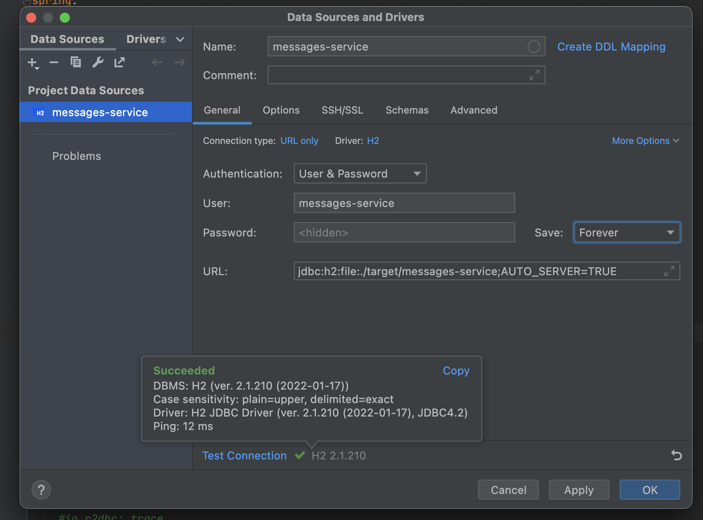

# RSocket system [](https://github.com/daggerok/r-socket-system/actions/workflows/ci.yaml)
Spring Webflux RSocket R2DBC end to end reactive system

Status: IN DEVELOPMENT

```bash
./mvnw clean ; ./mvnw

./mvnw -f users-service spring-boot:start
./mvnw -f messages-service spring-boot:start

http --ignore-stdin  get :8001
http --ignore-stdin  get :8002

open http://127.0.0.:8002
open http://127.0.0.:8001

./mvnw -f users-service spring-boot:stop
./mvnw -f messages-service spring-boot:stop
```

## Idea H2 how2



## RTFM
* [Render classpath resource](https://www.baeldung.com/spring-classpath-file-access)
+ [Fix R2DBC default values](https://github.com/spring-projects/spring-data-examples/blob/main/r2dbc/example/src/main/java/example/springdata/r2dbc/entitycallback/ApplicationConfiguration.java)
* [JDK Version Range](https://github.com/spring-projects/spring-framework/wiki/Spring-Framework-Versions#jdk-version-range) on the wiki
* [Official Apache Maven documentation](https://maven.apache.org/guides/index.html)
* [Spring Boot Maven Plugin Reference Guide](https://docs.spring.io/spring-boot/docs/2.6.6/maven-plugin/reference/html/)
* [Create an OCI image](https://docs.spring.io/spring-boot/docs/2.6.6/maven-plugin/reference/html/#build-image)
* [Coroutines section of the Spring Framework Documentation](https://docs.spring.io/spring/docs/5.3.18/spring-framework-reference/languages.html#coroutines)
* [Spring Data R2DBC](https://docs.spring.io/spring-boot/docs/2.6.6/reference/htmlsingle/#boot-features-r2dbc)
* [Spring Configuration Processor](https://docs.spring.io/spring-boot/docs/2.6.6/reference/htmlsingle/#configuration-metadata-annotation-processor)
* [Thymeleaf](https://docs.spring.io/spring-boot/docs/2.6.6/reference/htmlsingle/#boot-features-spring-mvc-template-engines)
* [Spring Reactive Web](https://docs.spring.io/spring-boot/docs/2.6.6/reference/htmlsingle/#web.reactive)
* [RSocket](https://rsocket.io/)
* [Acessing data with R2DBC](https://spring.io/guides/gs/accessing-data-r2dbc/)
* [Handling Form Submission](https://spring.io/guides/gs/handling-form-submission/)
* [Building a Reactive RESTful Web Service](https://spring.io/guides/gs/reactive-rest-service/)
* [R2DBC Homepage](https://r2dbc.io)
